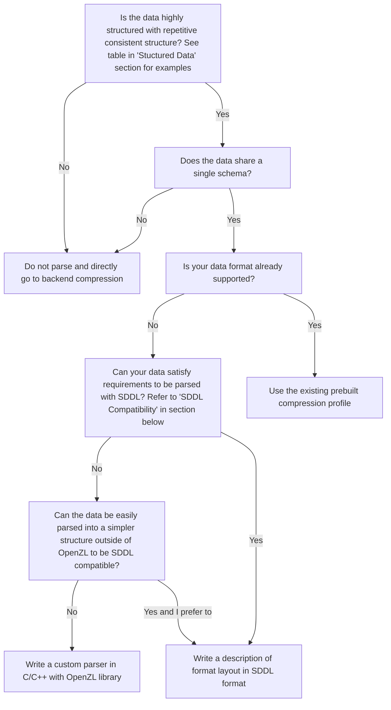
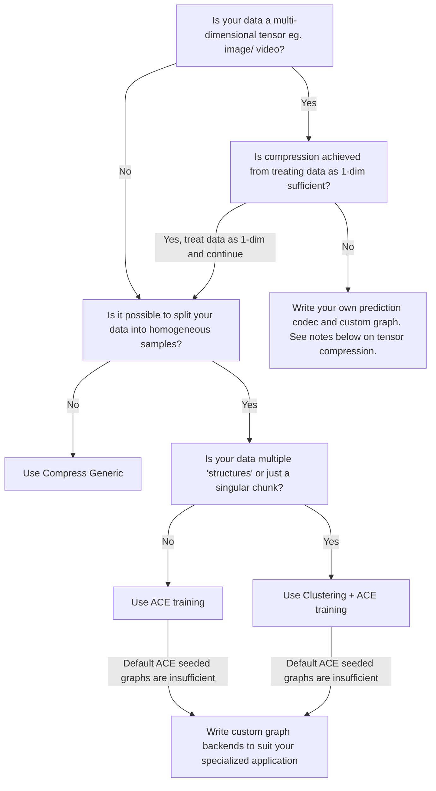

When building a good specialized compressor, there are two stages. The first stage is to parse the data to extract the structure. The second stage is to use good backend compressors that exploit the structure to achieve good compression. We have built tools for both of these stages in OpenZL. Refer to the flowchart below to learn which tools suit your application.

## Parsing

### Structured Data
| Good Formats    | Bad formats     |
| --------------- | --------------- |
| csv             | html            |
| parquet         |                 |
| protobuff       |                 |
| thrift          |                 |
| json            |                 |

Most data formats can benefit from parsing although to different extents. Csv and json are both highly structured and repetitive and are representative examples as formats that benefit significantly from parsing correctly. On the other hand, html is structured but not repetitive and will therefore not benefit much from parsing.

### SDDL Compatibility
While SDDL has the capability to describe any data format, some formats are easier to describe. Simpler formats have the following properties:

* No nested structures
* No variably sized structures

SDDL is generably suitable for data containing vector(s) with headers and footers. SDDL is however not suitable when there are stricter speed requirements due to being an interpreted language.

### Parsing Next Steps
* [SDDL usage ](../api/c/graphs/sddl.md)
* Prebuilt format compressors in the [CLI](cli.md)
* Writing a [custom parser](examples/c/custom-formats.md)

## Backend Compression

### Tensor Compression
Typically image/video data benefits from using lossy codecs as they can achieve much greater compression ratios by ignoring some noise. If lossless compression is required, then a custom prediction codec followed by entropy coding (Huffman/ FSE) can work well.
### ACE training
ACE is a powerful tool that uses codecs and graphs in OpenZL to create a good compressor based on the data it is compressing. In specialized applications where special codecs are required, ACE can also be seeded with these codecs to perform better.
### On the Roadmap
There are more features we are building related to training such as dictionary support which we expect to improve trained results over time.
### Backend Compression Next Steps
* Try the [numeric_array](examples/c/numeric-array.md) example
* See ACE tutorial
* Training in the [CLI](cli.md#training)
